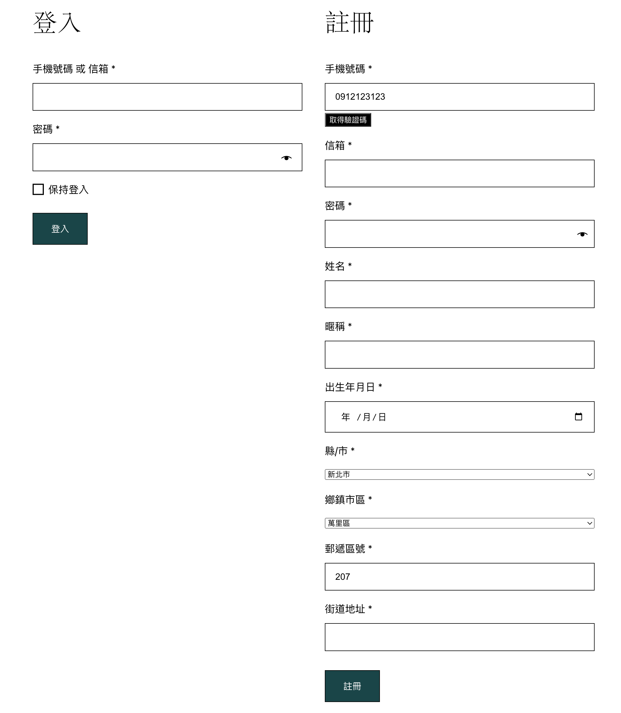

### WooCommerce 我的帳號（My Account）頁面註冊欄位客製化外掛

此外掛算是從某一個專案抽出來開源作為基礎客製化版本用的，並非完整版。使用上還需要根據自己需求客製化。

此外掛應用場景還包含串接簡訊 OTP 碼來註冊，並把「使用者帳號」（username）欄位直接作為台灣手機號碼使用，串接簡訊 OTP 的外掛在為 [三竹簡訊 OTP 外掛](https://github.com/nczz/mxp-mitake-sms-otp)

示意畫面：

